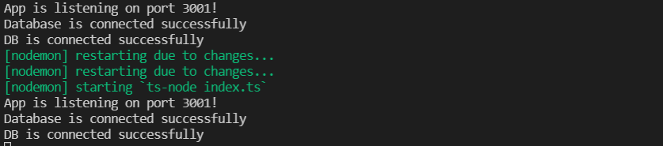

# App MERN Typescript

+ 

Created with 
+ *react-app.*
+ *Express.js*
+ *Mongodb*
+ *Pure CSS.*


## View Online in Vercel Deployinment (Desktop and responsive desing)
=>
+ [Click Here]().

# Directions for executing the project

# Install

+ `npm install`.

```
//wks-typescript/api (main)

`npm install` 
or 
`npm i`

```

+ Finally, run the process with `npm run dev` 

```
//wks-typescript/api (main)
npm run dev

```



# Preview 
